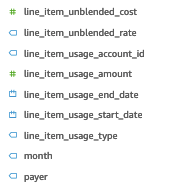
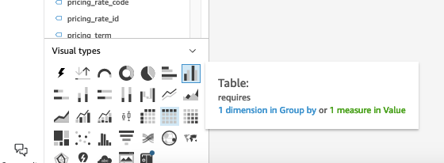

# Lab 2 :: Exploring Reserved Instances using CUR

Exploring Reserved Instances in Cost and Usage Report (CUR), and build our own visualization for reservation utilization in Quicksight using Quicksight Analysis and Quicksight Dataset.

## Prerequisite

1. User/role to log into an AWS account with QuickSight and CUR enabled,
2. Quicksight User (they are seperate from AWS account user/role) access to the CUR dataset.

## Part 1. Exploring the dataset available

Datasets are used to create Quicksight Analysis. By default, the avaiable dataset is generally the ones you own or the ones shared with you.

- Datasets has permissions, the owner/creators of the dataset holds the Owner permission by default.
- Request access to the dataset from the owner or create our own!
- Owners of datasets may create rules and apply "row-level" or "column-level" security [1], in additional to, "tag-based" [2] rules before sharing to the dataset for granular access.

### Sharing an existing dataset

1. On Quicksight, navigate to the Datasets page,
2. On a dataset, click the three dots, and manage permissions [3] by inviting Quicksight Users/Groups.

What's the difference between Direct Query vs. SPICE?

## Part 2. Creating an analysis

1. On Quicksight, navigate to the Analyses page,
2. Create "New Analysis" and select on our starting dataset to be used.

Additional datasets can be added to an analysis at any time; within the analysis, click on Visualize > edit Datasets pen symbol (edit), and Add dataset.

## Part 3. Exploring the CUR datasets

Let's explore Reserves!

[Understanding unused reservation costs](https://docs.aws.amazon.com/cur/latest/userguide/unused-reservation-costs.html)

- **Scenario 1: RI usage is 100%,** Table 2 – Unused RI costs for a 100% RI usage in AWS CUR
- **Scenario 2: Partial RI usage,** Table 4 – Unused RI costs for a partial RI usage in AWS CUR

[Understanding your amortized reservation data](https://docs.aws.amazon.com/cur/latest/userguide/amortized-reservation.html)

- **"Amortizing is when you distribute one-time reservation costs across the billing period that is affected by that cost."**

Additional context:
- [CUR Data dictionary/Line item details](https://docs.aws.amazon.com/cur/latest/userguide/Lineitem-columns.html)
- [CUR Data dictionary/Billing details](https://docs.aws.amazon.com/cur/latest/userguide/billing-columns.html)

## Part 4. Using the CUR dataset in action!

**Tips: Measure and Dimension inside a Dataset**

A field of a dataset [4] can be either:

- Measure (green icon, hash symbol)
- Dimension (blue icon, tag symbol)

Let's create a table that visualize our `reservation/UnusedQuantity` and `reservation/UnusedRecurringFee`.

Visualize it by the billing period, using the field `bill_billing_period_start_date`.

Exploring the select fields using different types of Visuals! 

## Part 5. Try this!
Try create this Pivot Table?

## References

[1] https://docs.aws.amazon.com/quicksight/latest/user/restrict-access-to-a-data-set-using-row-level-security.html

[2] https://catalog.workshops.aws/quicksight/en-US/anonymous-embedding/5-tag-based-rls

[3] https://docs.aws.amazon.com/quicksight/latest/user/sharing-data-sets.html

[4] https://docs.aws.amazon.com/quicksight/latest/user/setting-dimension-or-measure.html
